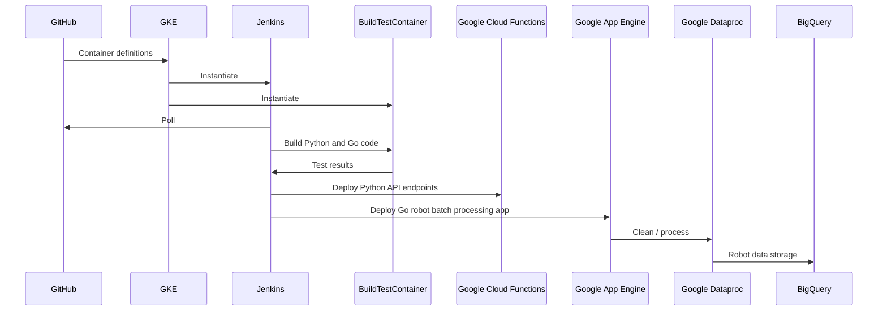

# Brain Corp
Examples for Brain Corp demonstrating:

- Git and GitHub experience
- Jenkins for CI/CD to go from git to live cloud deployment
  -- Google Cloud Build could be used instead
- API design
- Security and encryption
- Google Cloud Anthos for Jenkins and build/test containers
- Google Kubernetes Engine to configure containers
- Google Cloud Functions in Python (Robot event reporting API)
- Google App Engine design (Go batch processing of queue of events into BigQuery or GCS)

